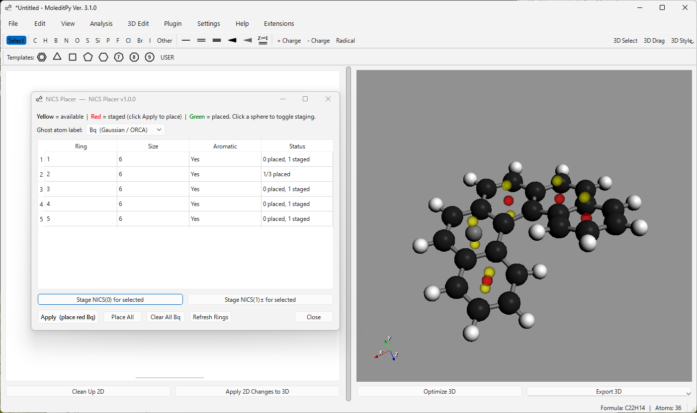

# MoleditPy NICS Placer Plugin



A [MoleditPy](https://github.com/HiroYokoyama/moleditpy) plugin that detects rings in the loaded molecule and places **Bq ghost atoms** at NICS(0) and NICS(1) probe positions for use in NICS (Nucleus-Independent Chemical Shift) calculations with ORCA.

## Features

- Detects all rings (aromatic and non-aromatic) from the 3D structure
- Computes NICS probe positions:
  - **NICS(0)** — ring centroid (in-plane)
  - **NICS(1)±** — ±1 Å above/below the ring plane (best-fit plane via SVD)
- Interactive 3-state sphere preview in the 3D viewport:
  | Colour | Meaning | Interaction |
  |--------|---------|-------------|
  | Yellow (semi-transparent) | Available, not staged | Click → turns red |
  | Red (semi-transparent) | Staged for placement | Click → turns yellow; Apply → places Bq |
  | Green | Bq atom already placed | Click "Clear All Bq" to remove |
- Table view with per-ring status (size, aromaticity, placement count)
- Helper buttons: Stage NICS(0)/NICS(1)± for selected rings, Place All, Clear All Bq
- Uses the `custom_symbol = "Bq"` atom property — automatically recognised by **ORCA Input Generator Pro** plugin

## Workflow

1. Load a molecule with 3D coordinates in MoleditPy.
2. Open **Analysis → NICS Placer…**
3. Yellow spheres appear at all ring NICS positions.
4. Click yellow spheres to stage them (turns red), or use **Stage NICS(0)/NICS(1)± for selected**.
5. Press **Apply (place red Bq)** to insert Bq dummy atoms at staged positions.
6. Use the molecule in **ORCA Input Generator Pro** — Bq labels appear automatically in the coordinate block.
7. Run NICS calculation in ORCA.

## Installation

Copy the `nics_placer/` folder into your MoleditPy plugins directory, or register it via the plugin manager:

```
moleditpy_nics_placer/
    nics_placer/
        __init__.py      ← plugin entry point (initialize function)
        dialog.py        ← NicsPlacerDialog (Qt6 + PyVista)
        nics_math.py     ← pure numpy ring geometry (no Qt/RDKit)
```

## Requirements

- MoleditPy ≥ v3 (V3 plugin API)
- PyQt6
- RDKit
- PyVista
- numpy

## Running Tests

The test suite runs fully headless (no Qt, RDKit, or PyVista required):

```bash
cd moleditpy_nics_placer
python -m pytest tests/ -v
```

| Test file | Coverage |
|-----------|----------|
| `test_nics_math.py` | Pure geometry: centroid, SVD normal, NICS point computation, ring extraction |
| `test_plugin_integration.py` | Plugin contract: save/load/reset handlers, Bq label persistence |

## Implementation Notes

### Ring plane (best-fit plane)

The ring normal is computed via SVD of the mean-centred atom positions:

```
centered = positions - mean(positions)
U, S, Vt = SVD(centered)
normal = Vt[-1]          # last singular vector = direction of minimum variance
normal /= ||normal||
```

This gives the least-squares best-fit plane normal, which is well-defined for all planar or near-planar rings.

### Ghost atom convention

Bq atoms are `rdkit.Chem.Atom(0)` (atomic number 0, dummy atom) with `SetProp("custom_symbol", "Bq")`. This is the same convention used by MoleditPy's XYZ Editor and ORCA Input Generator Pro.

## Version

1.0.0 — HiroYokoyama
