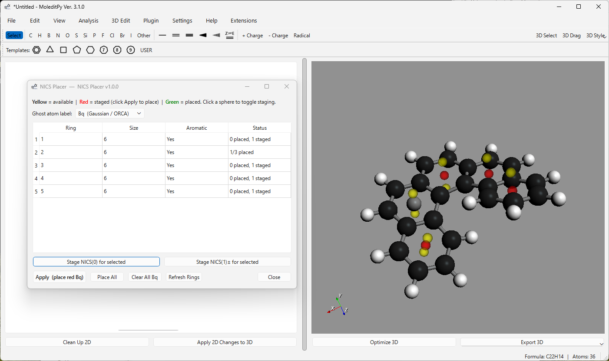
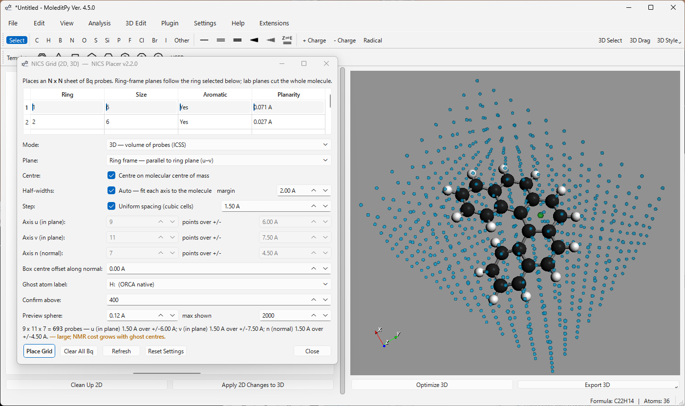

# MoleditPy NICS Placer Plugin

[](https://doi.org/10.5281/zenodo.20726104)
[](https://github.com/HiroYokoyama/moleditpy_nics_placer/actions/workflows/ci.yml)

[](https://github.com/HiroYokoyama/moleditpy_nics_placer/tags)
[](https://github.com/HiroYokoyama/moleditpy_nics_placer/releases)



A [MoleditPy](https://github.com/HiroYokoyama/python_molecular_editor) plugin that detects rings in the loaded molecule and places ghost atoms at NICS (Nucleus-Independent Chemical Shift) probe positions for calculations with ORCA or Gaussian.

Two modes, one per menu entry:

| Menu entry | What it places |
|---|---|
| **3D Edit → NICS Placer…** | Three probes per ring — NICS(0) and NICS(1)± |
| **3D Edit → NICS Grid (2D, 3D)…** | A rectangular plane or box of probes, for NICS scans and ICSS maps |

## Features

### NICS Placer (single probes)

- Detects **all rings** (aromatic and non-aromatic) from the 3D structure
- Computes NICS probe positions:
  - **NICS(0)** — ring centroid (in-plane)
  - **NICS(1)±** — ±1 Å above and below the ring plane (SVD best-fit plane). The **probe height** is adjustable, for NICS(0.5)/NICS(2) or to clear the atoms of a puckered ring.
- **Consistent faces** — every ring's normal is oriented against a shared molecular reference, so `nics1_above` means the same side of the molecule for every ring in a fused system
- **Planarity column** — the RMS deviation of each ring from its own best-fit plane, flagged with ⚠ above 0.1 Å where "1 Å above the ring plane" stops being well defined
- Interactive **3-state sphere preview** in the 3D viewport:

  | Colour | Meaning | Interaction |
  |--------|---------|-------------|
  | Yellow (semi-transparent) | Available, not staged | Click → turns red |
  | Red (semi-transparent) | Staged for placement | Click → turns yellow; Apply → places atom |
  | Green | Already placed in molecule | Clear All to remove |

- **Ghost atom symbol selector** — choose per project or set a persistent default:

  | Symbol | Software |
  |--------|----------|
  | `Bq` | Gaussian; also valid in ORCA (default) |
  | `H:` | ORCA native ghost atom notation |

- Table view with per-ring status (size, aromaticity, planarity, placed/staged count)
- Helper buttons: Stage NICS(0) / Stage NICS(1)± for selected rings, Place All, Clear All, Refresh
- **Auto-refresh** — when the molecule changes (load, undo/redo), rings and spheres update automatically
- Compatible with **ORCA Input Generator Pro** and **Gaussian Input Generator Neo** via the shared `custom_symbol` atom property

### NICS Grid (2D, 3D)

Lays down a whole lattice of probes so the shielding can be plotted as a surface or contoured as an isochemical-shielding surface (ICSS), rather than read off as three numbers per ring.



*A 3D box over chrysene. Uniform spacing at 1.5 Å gives 9 × 9 × 5 points over ±6.00 / ±6.00 / ±3.00 Å — the counts follow the molecule's shape while the step stays identical on every axis. The green sphere marks the ring the frame is anchored to, and the offset is greyed out because a 3D box is already centred.*

- **2D** — a plane of probes
- **3D** — a box of probes

**Every axis is independent** — its own point count and its own half-width. Molecules are rarely square, and the ring-current field decays over a few Å along the ring normal while the in-plane window usually has to span the whole ring system, so a square grid either wastes probes or clips the structure. Pass one number for a square/cubic grid or one per axis for a rectangle/box.

Six plane choices set the orientation (in 3D, the orientation of the box):

| Plane | Frame | Use |
|---|---|---|
| Parallel to ring plane (u–v) | Ring | Face map; at offset 1 Å this is a NICS(1) surface |
| Perpendicular, along u (u–n) | Ring | Side-on scan showing the ring-current cone |
| Perpendicular, along v (v–n) | Ring | As above, rotated 90° about the normal |
| XY / XZ / YZ | Lab | Fixed cuts through the whole molecule |

Ring-frame grids follow the ring selected in the table — *u* is anchored to the first ring atom, so rotating the molecule rotates the grid with it. The anchoring ring's centroid is marked with a **green sphere** in the 3D view so it is obvious which ring the grid is tied to. Lab planes are molecule-wide and show no marker, since the ring table does not apply to them.

- **Centre on molecular centre of mass** (default **on**) — the grid is centred on the mass-weighted centre of the molecule. Hydrogens count; ghost atoms have zero mass and so drop out on their own, which matters because otherwise every re-run would drag the centre toward the probes placed by the last one. Unchecking falls back to the ring's own centroid for a ring-frame grid (where a single-ring face map wants to sit) and to the heavy-atom bounding-box centre for a lab grid. The plane sets the orientation either way.

- **Auto half-widths** — each axis is fitted to the molecule separately by projecting every heavy atom onto that axis, plus a ~2 Å margin, so the field is sampled where it has decayed rather than clipped at the last atom. This is exact for a tilted ring frame too: a lab-space bounding box would either clip a tilted grid or, padded by its diagonal, massively oversize it. Uncheck to set the half-widths by hand.
- **Uniform spacing (cubic cells)** — derive the point counts from a step size (default 1 Å) instead of setting them directly. Each half-width is first grown to a whole number of steps, so the step comes out *exactly* the requested value on every axis while the counts still follow the molecular shape. Rounding only the count would not do this: half-widths of 4.4 / 4.3 / 4.2 at a 1 Å request all land on 10 points — counts identical — yet step 0.978 / 0.956 / 0.933.
- The **auto-fit margin** and the **confirmation threshold** are adjustable.
- Grids beyond 200,000 probes are reported rather than built. That is a responsiveness guard, not a chemistry one — the grid rebuilds on every control change, and the maximum 101 points on all three axes is over a million probes and several seconds per keystroke.
- **Offset** moves a 2D plane along its own normal — 1 Å gives a NICS(1) face map — and applies on every plane, lab planes included. It defaults to **0**, the ring plane itself, and is disabled in 3D, where the box already spans the normal symmetrically and an offset would only slide it off the centre you just chose.
- Live **probe count and per-axis spacing** readout, with the axes named for the current plane (X/Y/Z, or u/v/n in a ring frame); grids above 400 probes are flagged and confirmed before placement, since NMR cost grows with the number of ghost centres
- Ghost atoms are placed in one batch, and the preview is decimated above 2000 points so a large box does not stall the viewport

## Workflow

1. Load a molecule with 3D coordinates in MoleditPy.
2. Open **3D Edit → NICS Placer…**
3. Yellow spheres appear at all NICS(0), NICS(1)+, and NICS(1)− positions for every ring.
4. Click yellow spheres to stage them (turns red), or use the **Stage** buttons for bulk selection.
5. Select ghost atom symbol (`Bq` or `H:`) from the combo box.
6. Press **Apply (place red Bq)** to insert ghost atoms at all staged positions.
7. Open **ORCA Input Generator Pro** or **Gaussian Input Generator Neo** — ghost labels appear automatically in the coordinate block.
8. Run NICS calculation.

### Grid workflow

1. Open **3D Edit → NICS Grid (2D, 3D)…**
2. Choose **2D** (plane) or **3D** (volume).
3. Pick the plane. For a ring-frame plane, select the anchoring ring in the table; lab planes ignore the table.
4. Leave **Auto** checked to fit each axis to the structure, or uncheck it to set the half-widths yourself.
5. Set the point count per axis — or tick **Uniform spacing** and give a step size, and the counts follow.
6. Adjust the **offset** to move the grid along the plane normal (1 Å gives a NICS(1) face map).
7. Blue spheres preview the lattice in the 3D viewport; the label reports the shape, probe count and per-axis spacing.
8. Press **Place Grid**, then export as above.

**Reset Settings** restores every grid control to its default in one step; the ghost-atom label is left alone, since that is a persisted preference rather than a grid parameter.

## Settings & Persistence

### Plugin setting (`settings.json`)
The selected ghost atom symbol is saved to `nics_placer/settings.json` whenever it is changed. This is the **user default** — it persists across all sessions and documents.

### Project setting (`.pmeprj` project file)
When a project is saved, the current ghost symbol and all placed ghost atom indices are stored in the project file. Loading a project restores both, overriding the plugin default for that session. Closing the project (File → New) reverts to the plugin default from `settings.json`.

## Installation

Copy the `nics_placer/` folder into your MoleditPy plugins directory:

```
moleditpy_nics_placer/
    nics_placer/
        __init__.py      ← plugin entry point (registers both menu actions)
        dialog.py        ← NicsPlacerDialog (PyQt6 + PyVista)
        grid_dialog.py   ← NicsGridDialog — 2D/3D probe lattices
        nics_math.py     ← pure numpy ring + grid geometry
        settings.json    ← auto-created on first symbol change (gitignored)
```

## Requirements

- MoleditPy ≥ v3 (V3 plugin API)
- PyQt6
- RDKit
- PyVista
- numpy

## Running Tests

The test suite runs fully headless (no Qt, RDKit, or PyVista required):

```bash
cd moleditpy_nics_placer
python -m pytest tests/ -v
```

| Test file | Coverage |
|-----------|----------|
| `test_nics_math.py` | Pure geometry: centroid, SVD normal, NICS point computation, ring extraction |
| `test_nics_grid_math.py` | Normal orientation, aromaticity re-perception, planarity, ring frame, 2D grids, 3D volumes, molecule sizing |
| `test_dialog.py`, `test_dialog_class.py` | `NicsPlacerDialog` behaviour against headless Qt stubs |
| `test_grid_dialog.py` | `NicsGridDialog`: grid construction, auto-sizing, preview decimation, batch placement |
| `test_init_handlers.py` | Both menu entries, settings load/save branches |
| `test_plugin_integration.py` | Plugin contract: save/load/reset handlers, ghost label persistence, symbol persistence |

## Implementation Notes

### Ring plane (best-fit plane)

The ring normal is computed via SVD of the mean-centred atom positions:

```
centered = positions - mean(positions)
U, S, Vt = SVD(centered)
normal = Vt[-1]       # last singular vector = direction of minimum variance
normal /= ‖normal‖
```

This gives the least-squares best-fit plane normal, robust for all planar and near-planar rings.

### Normal orientation

SVD returns an eigenvector, so its **sign is arbitrary** — for naphthalene the two ring normals come back antiparallel. Left alone, that puts ring 1's `nics1_above` on the opposite molecular face from ring 0's, and any cross-ring comparison of NICS(1) on a molecule whose two faces differ is then comparing two different things. Every ring normal is therefore aligned to a shared reference (the best-fit plane over *all* ring atoms). Where no shared "up" exists — rings at right angles, as at a spiro junction — the fallback makes the largest-magnitude component positive, which is at least reproducible between runs.

### Aromaticity

The Aromatic column is computed by **re-perceiving aromaticity on a copy**, not by reading the flags already on the molecule. MMFF optimisation kekulises in place and RDKit does not restore the flags afterwards, so a molecule arriving straight from the force field reports azulene as non-aromatic. Perceiving on a copy leaves the caller's molecule untouched.

### Grid sizing

Half-widths are computed by projecting every heavy atom onto each of the three **grid** axes and taking the largest |projection| plus a margin. Doing it in the grid's own frame rather than in lab coordinates is what lets a tilted ring-frame grid fit snugly. Note that a ring-frame grid is centred on **its ring**, not on the molecule, so an off-centre ring legitimately needs a longer reach in one direction than the molecule's own half-width.

### Planarity

Each ring reports the RMS displacement of its atoms from its own best-fit plane. Planar arenes come out at ~0; a cyclohexane chair is ~0.23 Å and a tub-shaped cyclooctatetraene ~0.38 Å. Above 0.1 Å the row is flagged: the probe is still placed — puckered rings are legitimate NICS subjects — but "1 Å above the ring plane" is only approximate there.

### Ghost atom convention

Ghost atoms are `rdkit.Chem.Atom(0)` (atomic number 0, dummy atom) with `SetProp("custom_symbol", symbol)`. The `custom_symbol` property is the shared convention used by MoleditPy's XYZ Editor, ORCA Input Generator Pro, and Gaussian Input Generator Neo.

## Version

2.2.0 — HiroYokoyama

## License & Disclaimer

This project is licensed under the GNU General Public License v3.0 (GPLv3) - see the [LICENSE](LICENSE) file for details. As open-source software, it is provided 'as is' without warranty of any kind, and the author assumes no responsibility or liability for the results. Although outputs have been carefully verified, users are strongly encouraged to independently check and validate them for critical applications (such as publications). If you encounter any bugs, please open an issue.

